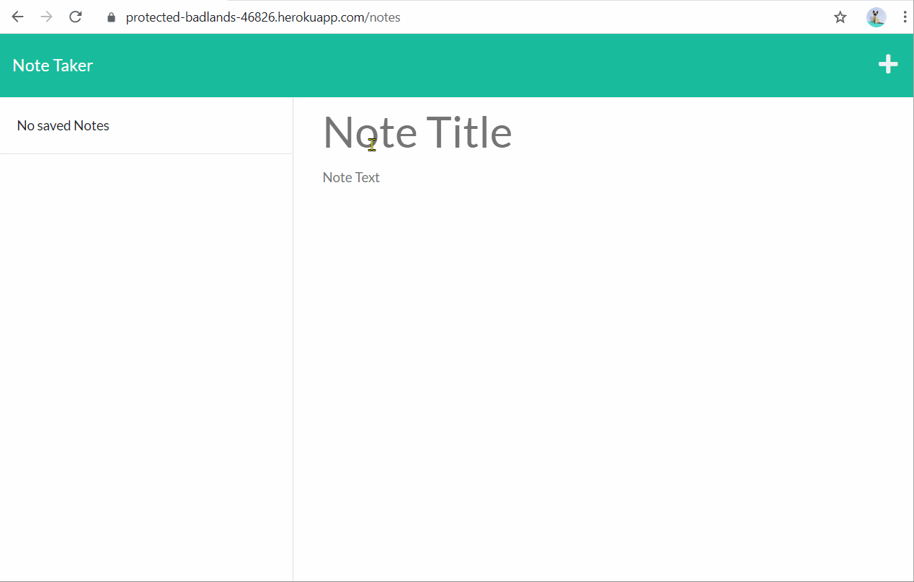

# Note Taker Web App
  -----------------

## Table of Contents
  - [Description](#Description)
  - [Installation Instructions and Getting Started](#Installation)
  - [Built With](#Built)
  - [Technologies Used](#Technologies)
  - [Authors](#Authors)
  - [Acknowledgments](#Acknowledgments)

## Description
Don't want to kill another tree? Write your notes in here! This is a note taking app that utilizes Node.js, Express.js, and Heroku.

Features~~
* Persistent data storage of notes.
* Add and delete buttons for notes.

[Click this link to go to the Note Taker web app!](https://protected-badlands-46826.herokuapp.com/)

  

## Installation Instructions and Getting Started
Node.js and Express.js need to be installed. To start the application, navigate in a command console to the folder that houses server.js and enter in 'npm start', or 'node server.js'.

## Built With
* [HTML](https://developer.mozilla.org/en-US/docs/Web/HTML)
* [CSS](https://developer.mozilla.org/en-US/docs/Web/CSS)
* [JavaScript](https://developer.mozilla.org/en-US/docs/Web/JavaScript)
* [Node.js](https://nodejs.org/en/)
* [Express.js](https://expressjs.com/)

## Technologies Used
* [Microsoft Visual Studio Code](https://code.visualstudio.com/)
* [Git Bash](https://git-scm.com/downloads)
* [GitHub](https://github.com/)
* [Heroku](https://www.heroku.com/)
* [Insomnia](https://insomnia.rest/)

## Practices Used
* Agile style User Story and Acceptance Criteria.

## Authors
**Alexander Gibson** 

- [Link to Alex's Portfolio Site](https://argibson02.github.io/Professional-Portfolio-2/)
- [Link to Alex's Github](https://github.com/argibson02)
- [Link to Alex's LinkedIn](www.linkedin.com/in/alexander-gibson-1b0bb6105)

## Acknowledgments 😊
- Thanks to Jerome, Manuel, Cheng, and Daniel for instructing the UCB Coding Bootcamp.

